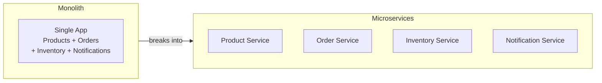
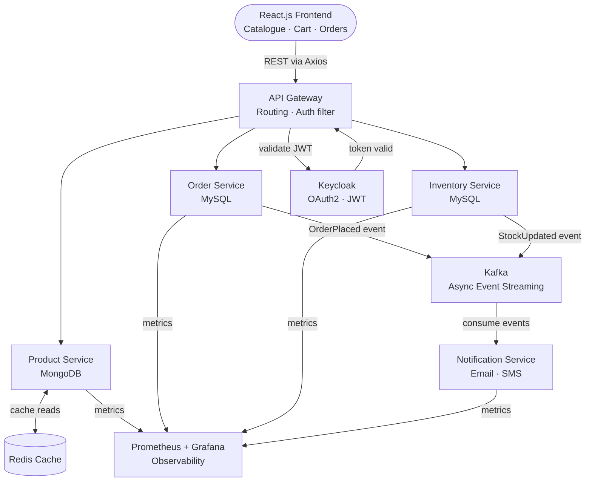
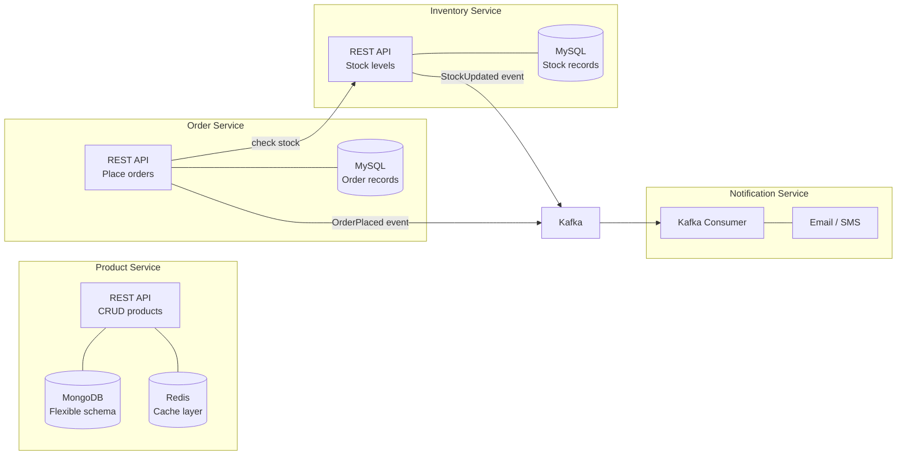
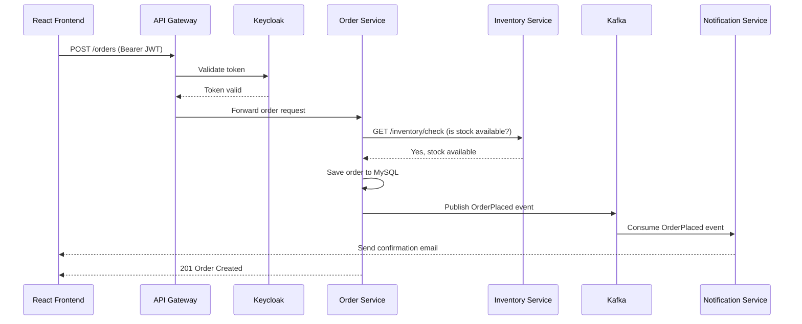
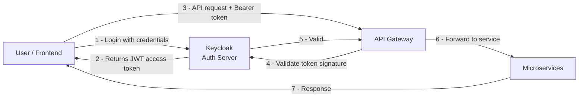
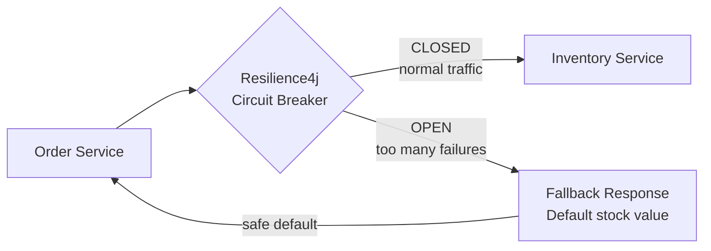
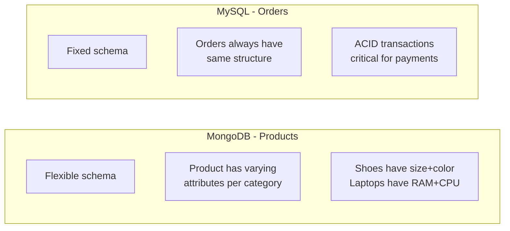
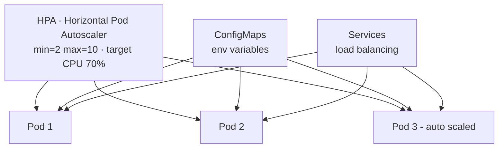

# E-Commerce Microservices Platform

 
> Java 21 · Spring Boot 3.2 · Kafka · React.js · MongoDB · Redis · Keycloak · Docker · Kubernetes

---

## What is this project?

A production-style **E-Commerce platform** built as 4 independent microservices —
each service owns its own database, communicates asynchronously via Kafka, and is
secured with Keycloak OAuth2/JWT. The entire platform is containerised with Docker
and orchestrated via Kubernetes with auto-scaling (HPA).

This project demonstrates:
- True microservice isolation — each service has its own DB, no shared tables
- Async event-driven communication via Kafka — no tight coupling between services
- Production-grade security via Keycloak OAuth2/JWT
- Resilience patterns via Resilience4j circuit breaker
- Full observability via Prometheus and Grafana
- Kubernetes orchestration with Horizontal Pod Autoscaler

---

## What is Microservices Architecture?

In a monolith, all features (products, orders, inventory, notifications) live in
one codebase and one database. If one part fails, everything fails.

In microservices, each feature is an **independent service** with its own codebase,
its own database, and its own deployment. They talk to each other through APIs or
events.


---

## High Level Design


---

## The 4 Microservices


---

## Order Placement — Step by Step Flow


---

## Security Flow — Keycloak OAuth2 / JWT

Instead of each microservice managing its own login logic, Keycloak acts as a
central Identity Provider. Every service trusts the same JWT token.


**Why Keycloak?**
- Zero auth code inside microservices — they just validate the JWT
- Role-based access control managed in one place
- Industry-standard OAuth2/OpenID Connect
- Supports SSO across all services

---

## Resilience Pattern — Circuit Breaker

When Order Service calls Inventory Service, what happens if Inventory is down?
Without a circuit breaker, Order Service hangs and eventually crashes too
(cascade failure). Resilience4j prevents this.


**Three states:**
- `CLOSED` — everything normal, requests pass through
- `OPEN` — too many failures detected, requests go to fallback immediately
- `HALF-OPEN` — testing if the service recovered, lets a few requests through

---

## Why Kafka over REST for inter-service communication?

| | Synchronous REST | Asynchronous Kafka |
|---|---|---|
| Coupling | Tight — Order waits for Notification | Loose — Order publishes, moves on |
| If Notification is down | Order request fails | Event stays in Kafka, consumed later |
| Scalability | Limited by slowest service | Each service scales independently |
| Use case | Inventory check (needs immediate answer) | Notification (fire and forget) |

In this project:
- Order → Inventory = **REST** (needs immediate stock confirmation)
- Order → Notification = **Kafka** (fire and forget, no need to wait)

---

## Tech Stack

| Technology | Version | Role in this project |
|---|---|---|
| **Java** | 21 | Core language — virtual threads, records |
| **Spring Boot** | 3.2 | Microservice framework for all 4 services |
| **Apache Kafka** | — | Async event streaming — OrderPlaced, StockUpdated events |
| **React.js** | — | Frontend — product catalogue, cart, order history via Axios |
| **MongoDB** | — | Product Service DB — flexible document store for product catalogue |
| **MySQL** | — | Order + Inventory Service — relational data, ACID transactions |
| **Redis** | — | Product catalogue cache — reduces MongoDB load on repeated reads |
| **Keycloak** | — | OAuth2/JWT auth server — central identity for all services |
| **Resilience4j** | — | Circuit breaker — prevents cascade failures between services |
| **Docker Compose** | — | Local multi-service orchestration — one command startup |
| **Kubernetes** | — | Production orchestration — HPA, ConfigMaps, Services |
| **Prometheus** | — | Scrapes metrics from all services every 15 seconds |
| **Grafana** | — | Live dashboards — request rate, latency, error rate per service |

---

## Why MongoDB for Products but MySQL for Orders?


- Products have different attributes per category — MongoDB's flexible documents
  handle this naturally. A shoe has size/color, a laptop has RAM/CPU.
- Orders always have the same structure and need ACID transaction guarantees —
  MySQL is the right tool.

---

## Kubernetes Setup


HPA automatically adds more pods when CPU exceeds 70% and removes them when
load drops — zero manual intervention.

---

## Observability Stack

Each service exposes metrics at `/actuator/prometheus`. Prometheus scrapes all
services and Grafana visualises them in real time.

**Metrics tracked per service:**
- HTTP request rate and latency (p50, p95, p99)
- Error rate (4xx, 5xx)
- JVM memory and GC activity
- Kafka consumer lag for Notification Service
- Redis cache hit/miss ratio for Product Service

---

## Project Structure
```
ecommerce-microservices-platform/
├── product-service/          # Spring Boot · MongoDB · Redis cache
│   ├── src/
│   └── Dockerfile
├── order-service/            # Spring Boot · MySQL · Kafka producer
│   ├── src/
│   └── Dockerfile
├── inventory-service/        # Spring Boot · MySQL · REST API
│   ├── src/
│   └── Dockerfile
├── notification-service/     # Spring Boot · Kafka consumer · Email
│   ├── src/
│   └── Dockerfile
├── api-gateway/              # Spring Cloud Gateway · Keycloak filter
├── frontend/                 # React.js · Axios · Cart · Orders
├── kubernetes/               # HPA · ConfigMaps · Services per microservice
└── docker-compose.yml        # Full local stack — one command startup
```

---

## Key Results

- 4 independent microservices each with their own DB — true service isolation
- Kafka async pipeline — order processing never blocked by notification delays
- Resilience4j circuit breaker — inventory failures return graceful fallback
- Keycloak OAuth2 — zero auth code inside microservices
- Kubernetes HPA — auto-scales pods on CPU load, zero downtime
- Full observability — Prometheus metrics scraped every 15s, Grafana dashboards
- Redis cache — repeated product reads served without hitting MongoDB

---


**Sai Krishna Darla** — Java Backend Engineer  
[LinkedIn](https://www.linkedin.com/in/saikrishna-darla/) ·
[GitHub](https://github.com/Dsk978)
```
```
